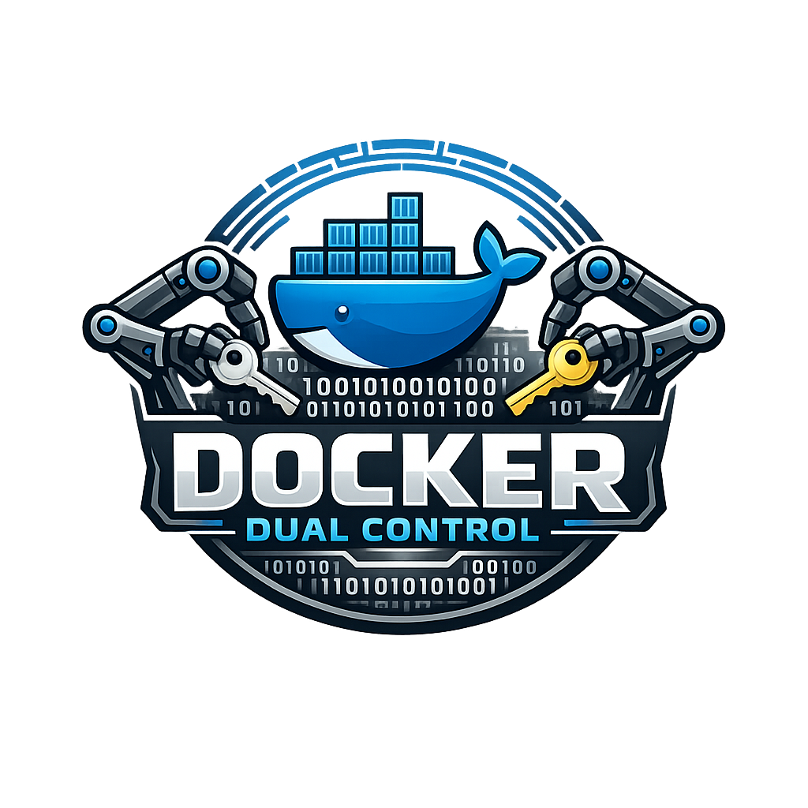
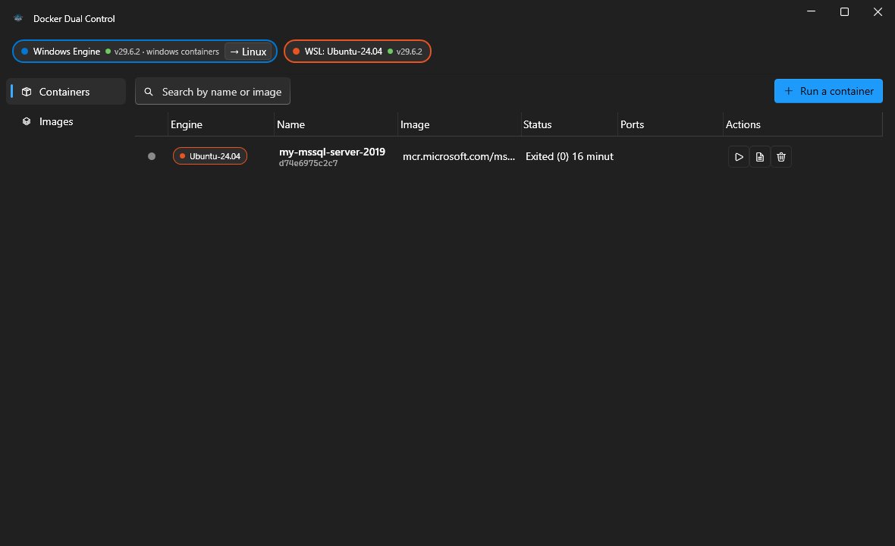

<p align="center">
  
</p>

# Docker Dual Control

A Windows desktop app that manages Docker containers on the **Windows engine and
inside WSL distros at the same time, in one list**.

Docker Desktop only shows containers belonging to the engine it is pointed at. If you
run `docker` inside a WSL distro (its own `dockerd`, not the Docker Desktop
integration), those containers are invisible to it. Docker Dual Control discovers every
engine on the machine and shows all of their containers together, each row tagged with
the engine it lives on.



## What it does

- **One unified list.** Containers and images from every reachable engine, side by side,
  colour-tagged per engine (blue = Windows, orange = WSL).
- **Container actions.** Start, stop, restart, view live logs, delete.
- **Create containers.** A run dialog with engine picker, image, name, port mappings,
  environment variables, volumes, and command override.
- **Images.** List across engines, pull to a chosen engine, run, delete.
- **Live logs.** Streaming `docker logs -f` in a follow-along window.
- **Live engine status.** Every engine is re-probed alongside the 3-second refresh, so
  the status chips track engines coming online or going offline in real time.
- **Start engines in-app.** An engine that is installed but not running gets a Start
  button (Docker Desktop via `docker desktop start` — no dashboard window — or the
  `docker` Windows service, or `systemctl`/`service` inside the WSL distro).
- **Container mode switching.** The Windows engine chip shows whether it is serving
  Linux or Windows containers and can switch between them (`docker desktop engine use`),
  pre-starting Docker Desktop's privileged helper service when needed.

## How it works

Every operation shells out to the docker CLI, so no daemon reconfiguration is needed:

| Engine | Invocation |
| --- | --- |
| Windows | `docker -H npipe:////./pipe/docker_engine …` |
| WSL distro | `wsl.exe -d <distro> -e docker …` |

Engines are discovered at startup: the Windows named pipe, plus every WSL distro from
`wsl -l -q` (excluding Docker Desktop's own utility distros). Each is probed with
`docker version`; unreachable engines are shown greyed out rather than hidden.

## Requirements

- Windows 10/11
- .NET 10 Desktop Runtime (or the SDK, to build)
- A docker CLI on `PATH` for the Windows engine, and/or docker installed inside a WSL distro

## Build and run

```powershell
dotnet build DockerDualControl.slnx -c Release
.\src\DockerDualControl.App\bin\Release\net10.0-windows\DockerDualControl.App.exe
```

Run the tests:

```powershell
dotnet test tests/DockerDualControl.Tests
```

## Project layout

```
src/DockerDualControl.Core/   Engine discovery, CLI transport, docker JSON models
src/DockerDualControl.App/    WPF UI (WPF-UI Fluent, MVVM)
tests/DockerDualControl.Tests/  xUnit tests for transport, parsing, arg building
```
